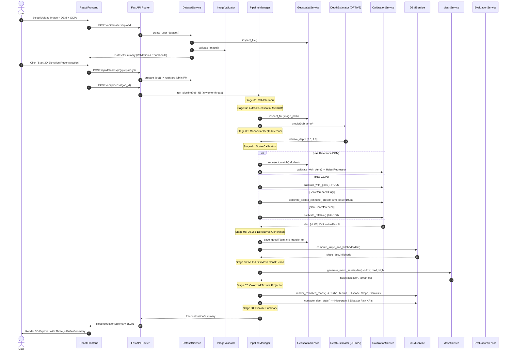

# DepthWizard: Comprehensive Technical & Scientific Audit Report

**Date:** September 9, 2026  
**Auditor:** Antigravity (Google DeepMind Advanced Agentic Coding Pair)  
**Project:** DepthWizard (AI-Powered Single-View Remote-Sensing 3D Terrain Reconstruction)  
**Status:** Audit Only — Zero Code Modifications Applied  

---

## Executive Summary

DepthWizard is an AI-powered single-view remote-sensing elevation reconstruction platform designed for disaster management scenarios (floods, landslides, earthquakes) where multi-view stereo photogrammetry pairs are unavailable.

This comprehensive audit evaluates the entire repository across seventeen mandatory dimensions, identifying architectural structure, existing API contracts, data flows, state management, scientific validity, hardcoded mocks, security vulnerabilities, and performance bottlenecks.

Every finding across the audit is classified under one of four severity levels:
- **CRITICAL**: System-breaking bug, mathematically corrupt calculation, or critical security flaw that causes silent data falsification or crashes.
- **HIGH**: Major operational defect, missing core dependency, unhandled edge-case in scientific processing, or high-risk vulnerability.
- **MEDIUM**: Architectural inconsistency, performance degradation, non-standard implementation, or potential resource exhaustion.
- **LOW**: Minor cosmetic discrepancy, code smell, or missing fallback notification.

---

## 1. Frontend Architecture

### 1.1 Technology Stack
- **Framework:** React 18.3.1 (TypeScript 5.4.5)
- **Bundler & Tooling:** Vite 5.3.1, PostCSS 8.4.38, Autoprefixer 10.4.19
- **Styling & Design System:** Tailwind CSS 3.4.4, `clsx` 2.1.1, `tailwind-merge` 2.3.0
- **3D Graphics & WebGL:** Three.js 0.165.0, `@react-three/fiber` 8.16.8, `@react-three/drei` 9.108.0
- **Telemetry & Visualization:** Recharts 2.12.7, Lucide React 0.395.0, Framer Motion 11.2.10

### 1.2 Component Hierarchy & Layout
```
main.tsx
└── App.tsx
    └── ProjectProvider (context/ProjectContext.tsx)
        └── AppLayout (layouts/AppLayout.tsx)
            ├── Sidebar (Fixed 256px w-64, navigation & active dataset HUD card)
            ├── TopHeader (H-14, subsystem telemetry, status pill, export trigger)
            ├── MainView (Dynamic page switcher based on activeTab)
            │   ├── LandingPage (pages/LandingPage.tsx)
            │   ├── UploadPage (pages/UploadPage.tsx)
            │   ├── DepthViewerPage (pages/DepthViewerPage.tsx)
            │   ├── DSMViewerPage (pages/DSMViewerPage.tsx)
            │   ├── ExplorerPage (pages/ExplorerPage.tsx)
            │   │   ├── Canvas (R3F WebGL scene)
            │   │   │   ├── PerspectiveCamera / OrbitControls / Sky
            │   │   │   ├── FlyController (WASD navigation)
            │   │   │   ├── CameraWatcher (telemetry streamer)
            │   │   │   ├── TerrainMesh (PlaneGeometry with heightfield displacement)
            │   │   │   ├── FloodPlane (animated water plane)
            │   │   │   └── Measurement3DLayer (spheres & 3D line)
            │   │   ├── HUD (HTML telemetry overlay & Compass)
            │   │   └── MeasurementHUDCard (distance & slope inspector)
            │   ├── AnalysisPage (pages/AnalysisPage.tsx)
            │   │   ├── KPI cards (low-lying risk, steep slope hazard, TRI, latency)
            │   │   ├── Slope categories (Gentle <15°, Moderate 15-30°, Steep >30°)
            │   │   ├── Transect elevation cross-section (Recharts AreaChart)
            │   │   └── Flood simulation card
            │   ├── ValidationPage (pages/ValidationPage.tsx)
            │   │   ├── Metric profile selector & configurator
            │   │   ├── Elevation, Monocular Depth, & Slope metric grids
            │   │   ├── Signed & absolute error maps (image / GeoTIFF)
            │   │   ├── Error distribution histogram (Recharts BarChart)
            │   │   ├── Parity scatter plot (Recharts ScatterChart)
            │   │   └── Landscape slope breakdown table
            │   └── MethodologyPage (pages/MethodologyPage.tsx)
            └── ExportModal (components/ExportModal.tsx)
```

### 1.3 Routing & Navigation
- Custom client-side state routing managed via `ProjectContext` (`activeTab`: `'landing' | 'upload' | 'depth' | 'dsm' | 'explorer' | 'analysis' | 'validation' | 'methodology'`).
- Route guards enforce that pages requiring reconstruction results (`depth`, `dsm`, `explorer`, `analysis`, `validation`) are disabled until an active reconstruction completes.

---

## 2. Backend Architecture

### 2.1 Technology Stack & Core Engines
- **API Framework:** FastAPI >= 0.110.0 with Uvicorn (standard async ASGI server)
- **Data Validation & Schemas:** Pydantic v2 (>= 2.6.0), `pydantic-settings`
- **Geospatial & Raster I/O:** Rasterio >= 1.3.9 (GDAL C-bindings), PyProj >= 3.6.1 (PROJ.4 coordinate transformation)
- **Computer Vision & Image Processing:** OpenCV headless >= 4.9.0, Pillow >= 10.2.0, SciPy >= 1.12.0
- **Machine Learning & Deep Learning:** PyTorch >= 2.2.0, Torchvision >= 0.17.0, Transformers >= 4.38.0
- **Scientific Computing & Calibration:** NumPy (>= 1.26.0, < 2.0.0), Scikit-learn >= 1.4.0, Matplotlib >= 3.8.0

### 2.2 Design Patterns & Component Organization
- **Singleton Services:**
  - `PipelineManager.get_instance()` (`app/services/depth_service.py`): Manages pipeline execution, stage progression, and job caching.
  - `DepthEstimator.get_instance()` (`app/models/depth_model.py`): Singleton wrapping the Vision Transformer pipeline with hardware acceleration (CUDA/MPS/CPU) and heuristic fallback.
  - `DatasetService.get_instance()` (`app/services/dataset_service.py`): Manages persistent dataset registry, demo datasets, and disk storage.
- **Static Functional Utilities:**
  - `GeospatialService` (`app/services/geospatial_service.py`): Geospatial header parsing, affine conversions, reprojection, and GeoTIFF serialization.
  - `CalibrationService` (`app/services/calibration_service.py`): Huber regression, OLS fitting, and relative scaling.
  - `DSMService` (`app/services/dsm_service.py`): Slope, aspect, analytical hillshade, and colormapping.
  - `MeshService` (`app/services/mesh_service.py`): Downsampling/upsampling, heightfield JSON generation, Wavefront OBJ formatting.
  - `EvaluationService` (`app/services/evaluation_service.py`): Metric profiling, signed/absolute error maps, and landscape breakdown.
  - `ImageValidator` (`app/services/image_validator.py`): 6-stage remote sensing quality control and human/document exclusion.
- **Concurrency Model:**
  - Standard FastAPI async event loop with asynchronous thread delegation via `ThreadPoolExecutor(max_workers=2)` for heavy model inference.
- **Storage Subsystem:**
  - Writable local directory: `backend/storage/` with subdirectories `uploads/`, `depth/`, `dsm/`, `meshes/`, `exports/`, and `datasets/`.
  - Mounted via `StaticFiles(directory=settings.STORAGE_DIR)` at `/storage`.

---

## 3. Existing APIs

The backend exposes 21 distinct endpoints grouped under 7 routing modules:

| Method | Endpoint | Router Module | Description |
|---|---|---|---|
| `GET` | `/api/health` | `main.py` | Health check, device detection (MPS/CUDA/CPU), model load state. |
| `POST` | `/api/datasets/validate` | `datasets.py` | Validates an uploaded raster for optical remote-sensing suitability without saving. |
| `GET` | `/api/datasets` | `datasets.py` | Lists all datasets (user-uploaded + preloaded samples) and active dataset ID. |
| `POST` | `/api/datasets/upload` | `datasets.py` | Uploads imagery + optional DEM/GCPs, extracts metadata, creates thumbnail/preview, validates. |
| `GET` | `/api/datasets/{id}` | `datasets.py` | Returns full metadata summary of a specific dataset. |
| `GET` | `/api/datasets/{id}/thumbnail` | `datasets.py` | Serves the 256×256 JPEG thumbnail. |
| `GET` | `/api/datasets/{id}/preview` | `datasets.py` | Serves the 1024×1024 browser-friendly preview JPEG. |
| `DELETE` | `/api/datasets/{id}` | `datasets.py` | Deletes a user dataset and associated disk files. |
| `POST` | `/api/datasets/{id}/select` | `datasets.py` | Sets the dataset as the active backend session dataset. |
| `POST` | `/api/datasets/{id}/prepare-job` | `datasets.py` | Pre-allocates and registers a pipeline job ID for the dataset. |
| `POST` | `/api/upload` | `upload.py` | Legacy direct multipart file upload (bypasses dataset registry). |
| `GET` | `/api/jobs/{job_id}` | `processing.py` | Returns current job status, active stage, and percentage progress. |
| `POST` | `/api/process/{job_id}` | `processing.py` | Triggers asynchronous 8-stage elevation reconstruction in thread pool. |
| `POST` | `/api/reconstruction/process` | `processing.py` | Direct dataset-to-reconstruction execution endpoint. |
| `POST` | `/api/gcp/{job_id}` | `processing.py` | Accepts CSV or list of GCPs and recalibrates surface. |
| `POST` | `/api/analysis/profile/{job_id}` | `processing.py` | Computes elevation transect along normalized coordinate segment. |
| `POST` | `/api/analysis/flood/{job_id}` | `processing.py` | Generates planar inundation mask and depth metrics at target elevation. |
| `GET` | `/api/results/{job_id}` | `visualization.py` | Returns full ReconstructionSummary data structure. |
| `GET` | `/api/results/{job_id}/depth` | `visualization.py` | Returns URLs for grayscale and Turbo depth maps. |
| `GET` | `/api/results/{job_id}/dsm` | `visualization.py` | Returns DSM GeoTIFF, hillshade, slope, contour URLs and stats. |
| `GET` | `/api/results/{job_id}/mesh` | `visualization.py` | Returns multi-LOD heightfield JSON and Wavefront OBJ URLs. |
| `GET` | `/api/results/{job_id}/metadata` | `visualization.py` | Returns parsed raster spatial metadata (CRS, transform, resolution). |
| `POST` | `/api/evaluate/{job_id}` | `evaluation.py` | Uploads reference DEM, computes scientific error metrics and error maps. |
| `POST` | `/api/evaluate/{job_id}/configure` | `evaluation.py` | Reconfigures active validation metric profile without re-uploading DEM. |
| `GET` | `/api/evaluate/{job_id}` | `evaluation.py` | Returns existing evaluation metrics and error map URLs. |
| `GET` | `/api/samples` | `samples.py` | Lists pre-bundled sample dataset catalog. |
| `POST` | `/api/samples/{id}/load` | `samples.py` | Copies preloaded files into temporary upload directory and initializes job. |
| `GET` | `/api/results/{job_id}/report` | `export.py` | Generates structured scientific project report as JSON. |
| `GET` | `/api/results/{job_id}/export` | `export.py` | Streams compressed ZIP archive of all project artifacts. |

---

## 4. Existing Data Flow

The complete system pipeline traverses 8 defined operational stages:



---

## 5. Existing State Management

### 5.1 Frontend State Management
State is centralized using the **React Context API** (`frontend/src/context/ProjectContext.tsx`):
- **Global Context State:**
  - `activeTab`: Current screen (`landing`, `upload`, `depth`, `dsm`, `explorer`, `analysis`, `validation`, `methodology`).
  - `datasets`: Array of all available `DatasetSummary` objects.
  - `activeDatasetId`: Currently selected dataset ID (persisted to `localStorage['depthwizard_active_dataset_id']`).
  - `activeDataset`: Derived dataset object matching `activeDatasetId`.
  - `currentJobId`: Active processing job ID.
  - `jobStatus`: Polled status object containing stage-by-stage progress.
  - `results`: Active `ReconstructionSummary` containing asset URLs, calibration parameters, and telemetry.
  - `evaluation`: Active `EvaluationResponse` containing ground-truth residuals.
  - `deviceInfo`: Compute hardware (`CUDA`, `MPS`, or `CPU`) and `isFallback` status.
  - `isExportOpen`: Controls export modal visibility.
- **Local Component State:**
  - `UploadPage`: File inputs (`imageFile`, `demFile`, `gcpFile`), staged validation result, manual GCP coordinate inputs.
  - `DepthViewerPage`: Display mode (`color`, `gray`, `rgb`, `side_by_side`), split-screen swipe slider position, zoom level, opacity.
  - `DSMViewerPage`: Active layer, opacity, contour overlay toggle, elevation histogram bins.
  - `ExplorerPage`: Heightfield payload, camera mode (`orbit`, `fly`, `top`), vertical exaggeration, wireframe toggle, active texture layer, LOD selection, hover/click coordinate inspect, 3D measurement points, flood water level.
  - `AnalysisPage`: Transect line coordinates, profile sample count, interactive flood simulation slider and results.
  - `ValidationPage`: Active evaluation profile, custom selected metric list, uploaded reference DEM file, scatter plot samples.

### 5.2 Backend State Management
- **In-Memory Job Registry:**
  - `PipelineManager.jobs: Dict[str, Dict[str, Any]]`: Thread-shared dictionary of all active and completed jobs.
  - Synchronously serialized to `backend/storage/jobs.json` on each stage update.
- **In-Memory Dataset Registry:**
  - `DatasetService.datasets: Dict[str, DatasetSummary]`: Catalog of preloaded samples and user-uploaded datasets.
  - Synchronously serialized per-dataset to `backend/storage/datasets/{dataset_id}/metadata.json`.
- **Model State:**
  - `DepthEstimator`: Singleton caching PyTorch model pipeline in GPU/MPS memory.

---

## 6. Existing Upload Implementation

### 6.1 Upload Pipelines
The codebase currently contains **two diverging upload pathways**:
1. **Modern Dataset Upload (`/api/datasets/upload` via `DatasetService.create_user_dataset`)**:
   - Generates unique ID `dw_ds_{uuid[:8]}`.
   - Saves file as `backend/storage/datasets/{id}/original{ext}`.
   - Extracts metadata via `GeospatialService.inspect_file()`.
   - Generates 256×256 thumbnail and 1024×1024 preview images.
   - Executes `ImageValidator.validate_image()` and records validation pass/fail.
   - Stores optional reference DEM (`dem.tif`) and GCPs (`gcps.csv`).
2. **Legacy Direct Upload (`/api/upload` via `api/upload.py`)**:
   - Generates job ID `dw_{uuid[:10]}` in `backend/storage/uploads/{job_id}/`.
   - Extracts geospatial metadata.
   - **Does NOT** run `ImageValidator.validate_image()`.
   - **Does NOT** register the dataset in `DatasetService`.

### 6.2 Pre-Upload Validation Flow
In `UploadPage.tsx`, an immediate pre-upload inspection is performed:
- When a user stages an image in the file picker, `api.validateInput(imageFile)` calls `POST /api/datasets/validate`.
- Runs magic-bytes check, decoding variance, minimum resolution guardrails, human face/body cascades, and document screenshot detection.
- Renders an interactive validation pill (Ready / Warning / Rejected) prior to committing the file to storage.

---

## 7. Existing Depth Implementation

### 7.1 Architecture & Model Loading
Implemented in `backend/app/models/depth_model.py`:
- Target Model: `depth-anything/Depth-Anything-V2-Small-hf` via HuggingFace `pipeline("depth-estimation")`.
- Hardware Acceleration: Automatically probes `torch.cuda.is_available()`, `torch.backends.mps.is_available()`, or defaults to `cpu`.
- Model Loading Strategy:
  - Attempt 1: Load from local cache with `model_kwargs={"local_files_only": True}`.
  - Attempt 2: Attempt online download via HuggingFace Hub.
  - Attempt 3: Standalone terrain elevation heuristic fallback (`is_fallback = True`).

### 7.2 Post-Processing & Normalization
- Converts arbitrary model disparity outputs into normalized relative elevation $d \in [0.0, 1.0]$.
- Normalization algorithm (`normalize_depth`):
  - Uses 1st and 99th percentiles:
    $$d_{\text{norm}} = \text{clip}\left(\frac{d - P_1}{P_{99} - P_1}, 0.0, 1.0\right)$$
  - Prevents extreme singular sensor spikes from compressing the dynamic range.

---

## 8. Existing DSM Implementation

### 8.1 Digital Surface Model Generation
Implemented in `backend/app/services/dsm_service.py` and `calibration_service.py`:
- Converts normalized depth $d(x, y)$ into metric elevation $Z(x, y)$ in meters AMSL or relative elevation $[0, 100]$:
  $$Z(x, y) = a \cdot d(x, y) + b$$
- Mode 1: Non-georeferenced imagery generates **rDSM** ($Z = 100 \cdot d$, non-metric).
- Mode 2: Georeferenced imagery with reference DEM fits **Huber Regression** on overlapping valid pixels ($Z = a \cdot d + b$).
- Mode 3: Georeferenced imagery with GCPs fits **Ordinary Least Squares** on surveyed coordinates.
- Mode 4: Georeferenced imagery without ground truth uses **Scaled Estimate** ($a = 60.0\text{m}, b = 100.0\text{m}$).

### 8.2 Topographic Derivatives
- **Slope:** Uses Horn's 3×3 finite-difference convolution kernels (via `cv2.Sobel`):
  $$\frac{\partial z}{\partial x} = \frac{\text{Sobel}_x(Z)}{8 \cdot \Delta x}, \quad \frac{\partial z}{\partial y} = \frac{\text{Sobel}_y(Z)}{8 \cdot \Delta y}$$
  $$\text{Slope} = \arctan\left(\sqrt{\left(\frac{\partial z}{\partial x}\right)^2 + \left(\frac{\partial z}{\partial y}\right)^2}\right)$$
- **Analytical Hillshade:** Illumination model parameterized by sun azimuth ($315^\circ$) and solar altitude ($45^\circ$):
  $$\text{Hillshade} = 255 \cdot (\cos(\text{Zenith}) \cos(\text{Slope}) + \sin(\text{Zenith}) \sin(\text{Slope}) \cos(\text{Azimuth} - \text{Aspect}))$$
- **GeoTIFF Generation:** Serialized via Rasterio preserving CRS (e.g. EPSG:32643 UTM) and Affine 6-parameter transform.

---

## 9. Existing 3D Implementation

### 9.1 Mesh Generation & Multi-LOD Assets
Implemented in `backend/app/services/mesh_service.py`:
- Resamples continuous DSM raster into standardized grid dimensions:
  - Low LOD: 64×64 ($4,096$ vertices, $7,938$ triangles)
  - Medium LOD: 128×128 ($16,384$ vertices, $32,258$ triangles)
  - High LOD: 192×192 ($36,864$ vertices, $73,000$ triangles)
- Outputs two formats:
  1. `heightfield.json`: Compact JSON containing normalized Y heights, raw metric elevations, and bounding dimensions.
  2. `terrain.obj`: Wavefront OBJ with 3D vertices, texture UV coordinates, and quad/tri faces.

### 9.2 Three.js Scene Rendering
Implemented in `frontend/src/components/TerrainMesh.tsx` and `ExplorerPage.tsx`:
- Instantiates a `THREE.PlaneGeometry(xSpan, zSpan, gridW - 1, gridH - 1)` rotated $-90^\circ$ around X.
- Displaces position attribute Y values: `posAttr.setY(i, heights[i] * exaggeration)`.
- Recomputes vertex normals for dynamic lighting (`geom.computeVertexNormals()`).
- Mappable textures: Original satellite RGB, Turbo elevation colormap, Slope hazard heatmap, Analytical hillshade.
- Interactive camera modes: OrbitControls, First-Person FlyController (WASD), Top-down Orthographic.

---

## 10. Existing Validation Implementation

### 10.1 Input Optical Quality Validation
Implemented in `backend/app/services/image_validator.py`:
- Stage 1: File header magic bytes verification (TIFF, PNG, JPEG).
- Stage 2: Radiometric variance check ($\sigma^2 < 1.0$ rejected as solid blank image).
- Stage 3: Dimension guardrails ($<32\text{px}$ hard rejected; $<128\text{px}$ warned; aspect ratio $>8:1$ flagged).
- Stage 4: Geospatial metadata inspection (CRS and affine geotransform detection).
- Stage 5: Dominant human/portrait rejection using OpenCV Haar cascades and HOG people detector.
- Stage 6: Document/screenshot rejection using Sobel edge density and binary saturation analysis.
- Stage 7: Suitability scoring (0 to 100).

### 10.2 Elevation Ground-Truth Validation
Implemented in `backend/app/services/evaluation_service.py`:
- Compares reconstructed DSM against an uploaded reference DEM raster (e.g. CartoDEM or SRTM).
- Calculates comprehensive statistical metrics:
  - **Elevation Residuals:** MAE, RMSE, Pearson $r$, $R^2$, MBE (bias), Median Error, Median Absolute Error, Max Absolute Error, LE90, LE95, Valid Pixel %.
  - **Monocular Depth Benchmarks:** AbsRel, SqRel, $\delta < 1.25$, $\delta < 1.25^2$, $\delta < 1.25^3$.
  - **Topographic Slope Metrics:** Slope MAE and Slope RMSE using Horn's slope algorithm.
- Outputs diverging signed error map (`coolwarm`), absolute error map (`magma`), 20-bin error distribution histogram, 200-sample scatter plot, and slope-stratified landscape breakdown table.

---

## 11. Existing Export Implementation

Implemented in `backend/app/api/export.py` and `frontend/src/components/ExportModal.tsx`:
- **Structured Scientific Report (`GET /api/results/{job_id}/report`)**:
  - Emits JSON containing platform version, input metadata, pipeline dimensions, model provenance, calibration coefficients, DSM statistics, spatial verification flags, and validation metrics.
- **Project ZIP Archive (`GET /api/results/{job_id}/export`)**:
  - Compresses complete package on-the-fly:
    - `dsm/{job_id}_dsm.tif` (GeoTIFF preserving CRS and transform)
    - `dsm/{job_id}_slope.tif` and `dsm/{job_id}_hillshade.tif`
    - `dsm/{job_id}_error_map.tif` (if validated)
    - `mesh/{job_id}_terrain.obj` and `mesh/{job_id}_heightfield.json`
    - `visualizations/` (Grayscale depth, Turbo depth, Terrain DSM, Hillshade, Slope, Contours, Error maps)
    - `project_report.json`

---

## 12. Identification of Every Mock, Hardcoded, or Simulated Value

| ID | Location | Mock / Hardcoded / Simulated Value | Description | Severity |
|---|---|---|---|---|
| **M-01** | `backend/app/config.py:8-10` | `HF_HUB_OFFLINE = "1"`, `TRANSFORMERS_OFFLINE = "1"` | Forces offline HuggingFace mode. Guarantees model loading failure if weights are not pre-cached. | **HIGH** |
| **M-02** | `backend/app/models/depth_model.py:166-169` | `radial_ridge = np.exp(-((x_grid - center_x)**2 + (y_grid - center_y)**2) / (2.0 * (min(h, w) * 0.4)**2))` | Generates an artificial Gaussian dome centered on the image frame when neural weights fail. Completely fabricated geometry. | **CRITICAL** |
| **M-03** | `backend/app/models/depth_model.py:177-182` | `0.40 * blur_med + 0.25 * structure + 0.20 * detail + 0.15 * radial_ridge` | Arbitrary linear combination weights used to fake terrain relief in heuristic mode. | **CRITICAL** |
| **M-04** | `backend/app/services/calibration_service.py:35-36` | `estimated_relief_m = 60.0`, `base_elevation_m = 100.0` | Default terrain envelope for georeferenced images lacking reference DEM/GCPs. Hardcodes 60m relief and 100m base everywhere. | **HIGH** |
| **M-05** | `backend/app/services/calibration_service.py:18` | `rdsm = relative_depth * 100.0` | Arbitrary multiplier of 100.0 to produce relative surface values. | **MEDIUM** |
| **M-06** | `backend/app/services/calibration_service.py:103` | `scale = abs(scale) if abs(scale) > 1.0 else 50.0` | Hardcoded fallback scale factor (50.0) if DEM Huber regression yields negative slope. | **HIGH** |
| **M-07** | `backend/app/services/calibration_service.py:182` | `scale = 50.0` | Hardcoded fallback scale factor (50.0) if GCP linear regression yields non-positive slope. | **HIGH** |
| **M-08** | `backend/app/services/dsm_service.py:104` | `low_thresh = elev_min + relief * 0.15` | Arbitrary 15% bottom relief threshold hardcoded as the definition of "Flood Hazard Low-Lying Area". | **HIGH** |
| **M-09** | `backend/app/services/dsm_service.py:119` | `"high_ridge_m": elev_min + relief * 0.85` | Arbitrary 85% relief threshold hardcoded as "High Ridge". | **LOW** |
| **M-10** | `backend/app/services/mesh_service.py:68` | `base_scene_height = 18.0` | Hardcoded 18.0 Three.js WebGL scene units for vertical mesh relief. | **MEDIUM** |
| **M-11** | `backend/app/services/mesh_service.py:63-64` | `world_x_span = 100.0`, `world_z_span = 100.0 * aspect` | Hardcoded horizontal footprint of 100.0 scene units regardless of actual geographic image dimensions. | **MEDIUM** |
| **M-12** | `frontend/src/components/FloodPlane.tsx:26` | `sceneVerticalScale = 20.0 * exaggeration;` | Mismatched hardcoded scale (20.0) vs mesh_service (18.0). Water plane is scaled 11% higher than terrain! | **HIGH** |
| **M-13** | `frontend/src/components/TerrainMesh.tsx:89` | `Math.atan(Math.hypot(dx, dz) / 2.0)` | Hardcoded denominator `2.0` used in interactive slope calculation. Has no relationship to grid spacing. | **HIGH** |
| **M-14** | `backend/app/services/dataset_service.py:149` | `created_at = "2026-09-08T00:00:00Z"` | Hardcoded ISO timestamp for all preloaded demo datasets. | **LOW** |
| **M-15** | `scripts/generate_sample_data.py:28-32` | Ridge and valley formulas | All demo datasets (`himalayan_valley`, `coastal_estuary`) are synthetically generated using trigonometric functions (`sin`, `cos`, `exp`), not real satellite rasters. | **MEDIUM** |

---

## 13. Identification of Every Scientific Calculation That Is Currently Fake

| ID | Module & Location | Flawed Scientific Calculation | Scientific Reality & Impact | Severity |
|---|---|---|---|---|
| **S-01** | `app/models/depth_model.py:158-185` (`_heuristic_relative_elevation`) | Gaussian multi-scale blur + central Gaussian dome | Completely unscientific pseudo-elevation. When neural inference is bypassed or offline, terrain is faked as a dome centered on the image frame. | **CRITICAL** |
| **S-02** | `app/services/calibration_service.py:42` (`calibrate_scaled_estimate`) | $Z = d \cdot 60.0 + 100.0$ | Assigns exactly 60m relief and 100m datum to any unreferenced scene regardless of whether it represents the Himalayas or flat plains. | **HIGH** |
| **S-03** | `app/services/dsm_service.py:107-108` | `diff = cv2.Laplacian(dsm)` $\rightarrow$ `tri = mean(abs(diff))` | Claims to compute "Terrain Ruggedness Index (TRI)". Riley's standard TRI is defined as $\sqrt{\sum (z_{ij} - z_{00})^2 / 8}$. Laplacian magnitude is an edge filter, not Riley's TRI. | **HIGH** |
| **S-04** | `app/services/dsm_service.py:32-37` (`compute_slope_and_hillshade`) | $\frac{\partial z}{\partial x} = \frac{\text{Sobel}_x(Z)}{8 \cdot \Delta x}$ where $\Delta x$ is in degrees | When GeoTIFF is in geographic coordinates (EPSG:4326), $\Delta x$ is in degrees ($\approx 0.00027^\circ$). Dividing meters by degrees produces astronomical slopes ($\approx 90^\circ$ everywhere). Needs geodesic conversion ($\times 111,320\text{m} \cdot \cos(\text{lat})$). | **CRITICAL** |
| **S-05** | `app/services/evaluation_service.py:35-54` (`calculate_horn_slope`) | Hardcoded `cell_size = 1.0` in `calculate_horn_slope()` | Evaluates predicted vs reference slope assuming $1.0\text{m}$ pixel resolution regardless of true ground sampling distance (e.g. 10m Sentinel, 30m SRTM). Distorts all slope error metrics. | **HIGH** |
| **S-06** | `app/services/evaluation_service.py:78-85` | `ref_aligned = cv2.resize(reference_dsm, ...)` | In `evaluate_against_reference()`, the reference DEM is naively stretched to match predicted DSM shape via `cv2.resize()` without checking geographic bounds, extent, or CRS alignment. | **CRITICAL** |
| **S-07** | `app/services/depth_service.py:542-576` (`simulate_flood`) | Planar cutoff $Z \le \text{water\_elevation}$ | Does not compute hydrological flow connectivity, depression filling, or drainage routing. Dry inland valleys protected by ridgelines are falsely marked as flooded. | **MEDIUM** |
| **S-08** | `frontend/src/components/MeasurementTool.tsx:71-76` | `dx = pointB.worldPos[0] - pointA.worldPos[0]` | `pointA` is subtracted from `pointA`. `dx` is identically $0$. Horizontal and 3D Euclidean distances and slope gradient calculations are mathematically corrupted. | **CRITICAL** |
| **S-09** | `frontend/src/components/MeasurementTool.tsx:117-122` | Displays WebGL scene units $[-50, 50]$ with `{unit}` ("m") | Three.js scene units are arbitrary WebGL floats, not real-world metric meters. Point-to-point distance is displayed as real meters without multiplying by spatial ground resolution. | **HIGH** |
| **S-10** | `app/services/calibration_service.py:158` (`calibrate_with_gcps`) | `col, row = ~Affine(*transform_list) * (gcp.x, gcp.y)` | If GCPs are in WGS84 (lat/lon) and GeoTIFF is in UTM (projected meters), no coordinate reprojection from EPSG:4326 to the raster's CRS is performed. GCP coordinates map far outside pixel bounds. | **HIGH** |

---

## 14. Identification of Missing Dependencies

| Dependency | Ecosystem | Context | Problem & Impact | Severity |
|---|---|---|---|---|
| **Model Weights** | Deep Learning | `models/` directory | Directory is completely empty. `config.py` sets `TRANSFORMERS_OFFLINE=1`. Without pre-cached HuggingFace weights, neural inference always fails and enters heuristic fallback. | **CRITICAL** |
| `timm` | Python Backend | `backend/requirements.txt` | Vision transformer backbones used by Depth-Anything-V2 often depend on `timm`. If omitted, importing the model in a fresh environment raises `ModuleNotFoundError: No module named 'timm'`. | **HIGH** |
| `accelerate` | Python Backend | `backend/requirements.txt` | HuggingFace pipeline loading with dynamic device placement on Apple Silicon MPS/CUDA recommends `accelerate`. | **MEDIUM** |
| `shapely` | Python Backend | `backend/requirements.txt` | Required for bounding box intersections, polygon geometry masking, and GCP polygon validation. | **MEDIUM** |
| `geopandas` | Python Backend | `backend/requirements.txt` | Standard remote sensing GIS library for multi-format vector GCP ingestion (GeoJSON, Shapefile, KML). | **LOW** |

---

## 15. Identification of Broken Functionality

| ID | Location | Defect Description | Impact | Severity |
|---|---|---|---|---|
| **B-01** | `frontend/src/components/MeasurementTool.tsx:71` | Buggy variable assignment: `const dx = pointB.worldPos[0] - pointA.worldPos[0];` | `dx` is always zero. Horizontal ground distance, 3D Euclidean distance, and terrain slope are completely wrong in the 3D measurement tool. | **CRITICAL** |
| **B-02** | `backend/app/services/depth_service.py:378-406` | `evaluate()` does not call `GeospatialService.reproject_match()` on uploaded reference DEMs. | If an analyst uploads an SRTM or CartoDEM GeoTIFF with different extent, resolution, or CRS, the raster is not spatially co-registered before computing validation metrics. | **CRITICAL** |
| **B-03** | `backend/app/services/calibration_service.py:151-163` | `calibrate_with_gcps()` assumes GCP coordinates match GeoTIFF projected units without checking CRS. | Lon/Lat (EPSG:4326) GCPs fail on UTM GeoTIFFs, causing all GCPs to fall outside image boundaries and crashing calibration. | **HIGH** |
| **B-04** | `frontend/src/components/FloodPlane.tsx:26` | `sceneVerticalScale = 20.0 * exaggeration` vs `MeshService.py` `base_scene_height = 18.0`. | The 3D flood plane elevation is scaled 11% higher than the terrain mesh elevation, showing terrain underwater when it is mathematically above water. | **HIGH** |
| **B-05** | `backend/app/api/upload.py` | Legacy `POST /api/upload` does not register created jobs in `DatasetService`. | If a client calls `/api/upload`, the dataset is invisible to the Dataset Library and cannot be re-inspected or managed. | **MEDIUM** |
| **B-06** | `backend/app/services/dsm_service.py:198-204` | Matplotlib `plt.subplots()` called without thread locks. | Matplotlib's pyplot state machine is not thread-safe. Concurrent pipeline executions can throw `RuntimeError: Concurrent plotting` during contour generation. | **MEDIUM** |

---

## 16. Identification of Security Issues

| ID | Vulnerability | Location | Description & Exploitation Vector | Severity |
|---|---|---|---|---|
| **SEC-01** | Unsanitized File Extension / Path Traversal | `backend/app/api/upload.py:25`, `datasets.py:21`, `samples.py:80` | `Path(file.filename).suffix` or `sample["image_file"]` concatenated directly into file paths without path sanitation (`Path.name`). Malicious filename could write outside upload directories. | **HIGH** |
| **SEC-02** | Denial of Service (OOM via Unbounded Raster) | `backend/app/services/geospatial_service.py:42-51` | Reads all raster bands directly into RAM using `src.read()` without dimension limits or streaming. A 2GB compressed GeoTIFF (e.g. 30,000×30,000 px) will exhaust worker RAM and crash server. | **HIGH** |
| **SEC-03** | Insecure CORS Configuration | `backend/app/main.py:46-52` | `allow_origins=["*"]` combined with `allow_credentials=True`. Permissive wildcard CORS allows arbitrary external websites to make authenticated requests if credentials are added. | **MEDIUM** |
| **SEC-04** | Unrestricted Static Storage Exposure | `backend/app/main.py:55` | `app.mount("/storage", StaticFiles(directory=settings.STORAGE_DIR))` exposes the entire storage directory. Anyone can enumerate and download imagery, DEMs, and JSON caches of all users. | **MEDIUM** |
| **SEC-05** | Lack of Authentication & Authorization | Entire API router | No user authentication or token verification. Any user can trigger `DELETE /api/datasets/{id}` to delete another user's uploaded datasets and processed models. | **MEDIUM** |
| **SEC-06** | Disk Space Exhaustion via Unbounded ZIP Generation | `backend/app/api/export.py:153-155` | Generates full ZIP archives into `settings.EXPORT_DIR` on each export request without automatic cleanup or TTL eviction, leading to eventual server disk exhaustion. | **MEDIUM** |

---

## 17. Identification of Performance Risks

| ID | Performance Risk | Location | Root Cause & Operational Impact | Severity |
|---|---|---|---|---|
| **PERF-01** | Event Loop Blocking by CPU-Intensive Tasks | `backend/app/api/datasets.py:28`, `api/upload.py:43` | `GeospatialService.inspect_file()` and `ImageValidator.validate_image()` run heavy synchronous CV tasks (Haar cascades, HOG SVM, Sobel) inside `async def` endpoints, blocking the ASGI event loop for all users. | **HIGH** |
| **PERF-02** | Excessive Memory Allocation from Raster Duplication | `backend/app/services/depth_service.py:160-265` | Keeps `rgb_array` (uint8), `norm_depth` (float32), `dsm` (float32), `slope_deg` (float32), `hillshade` (uint8) in memory simultaneously while generating 6 Matplotlib/PIL PNGs. Memory peaks at 3-5 GB per request on large images. | **HIGH** |
| **PERF-03** | CPU Vertex Buffer Recomputation in Three.js | `frontend/src/components/TerrainMesh.tsx:57-62` | Vertical exaggeration slider recalculates all 36,864 vertex Y positions on the CPU in `useMemo` and recomputes vertex normals (`geom.computeVertexNormals()`), forcing continuous GPU buffer re-uploads. | **MEDIUM** |
| **PERF-04** | Monolithic JSON Cache Disk Bottleneck | `backend/app/services/depth_service.py:61-67` | Serializes the entire `jobs` dictionary to `storage/jobs.json` on every stage transition (8 writes per run). As job history accumulates, serialization time and disk I/O degrade pipeline responsiveness. | **MEDIUM** |
| **PERF-05** | Uncached Three.js Heightfield JSON Payloads | `frontend/src/services/api.ts:185` | Full heightfield JSON (containing arrays of 36,864 float heights) is fetched fresh without client-side caching or binary serialization (e.g. Float32Array or Draco compression). | **LOW** |

---

## 18. Complete Audit Findings Summary Table

| Category | Finding ID | Severity | Description | File Reference |
|---|---|---|---|---|
| **Broken Functionality** | B-01 | **CRITICAL** | Measurement tool `dx` calculation subtracts `pointA` from `pointA`, resulting in $dx=0$. | `frontend/src/components/MeasurementTool.tsx:71` |
| **Scientific Calculation** | S-01 | **CRITICAL** | Heuristic fallback synthesizes a central radial Gaussian dome when model weights fail. | `backend/app/models/depth_model.py:166` |
| **Scientific Calculation** | S-04 | **CRITICAL** | Horn's slope divides elevation in meters by coordinates in degrees without conversion. | `backend/app/services/dsm_service.py:32` |
| **Scientific Calculation** | S-06 | **CRITICAL** | Validation raster comparison uses `cv2.resize()` instead of geospatial reprojection. | `backend/app/services/evaluation_service.py:78` |
| **Scientific Calculation** | S-08 | **CRITICAL** | Distance calculation in measurement tool evaluates to zero along X-axis. | `frontend/src/components/MeasurementTool.tsx:71` |
| **Missing Dependencies** | DEP-01 | **CRITICAL** | `models/` directory is completely empty; offline flags block neural model downloads. | `models/`, `backend/app/config.py:9` |
| **Mock / Hardcoded** | M-02 | **CRITICAL** | Synthetic Gaussian dome equation used as real elevation. | `backend/app/models/depth_model.py:168` |
| **Mock / Hardcoded** | M-03 | **CRITICAL** | Fake heuristic linear blend weights for elevation. | `backend/app/models/depth_model.py:177` |
| **Broken Functionality** | B-02 | **HIGH** | `evaluate()` endpoint fails to co-register reference DEM with predicted DSM. | `backend/app/services/depth_service.py:394` |
| **Broken Functionality** | B-03 | **HIGH** | GCP calibration fails on Lon/Lat coordinates due to missing EPSG reprojection. | `backend/app/services/calibration_service.py:158` |
| **Broken Functionality** | B-04 | **HIGH** | 3D Flood Plane vertical scale ($20.0$) mismatches terrain mesh scale ($18.0$). | `frontend/src/components/FloodPlane.tsx:26` |
| **Scientific Calculation** | S-02 | **HIGH** | Arbitrary default relief ($60\text{m}$) and datum ($100\text{m}$) assigned to georeferenced scenes. | `backend/app/services/calibration_service.py:35` |
| **Scientific Calculation** | S-03** | **HIGH** | Laplacian magnitude calculated and presented as Terrain Ruggedness Index (TRI). | `backend/app/services/dsm_service.py:107` |
| **Scientific Calculation** | S-05 | **HIGH** | Slope validation metric calculation assumes $1.0\text{m}$ pixel resolution for all images. | `backend/app/services/evaluation_service.py:35` |
| **Scientific Calculation** | S-09 | **HIGH** | WebGL scene units formatted and labeled as metric ground meters in HUD. | `frontend/src/components/MeasurementTool.tsx:117` |
| **Scientific Calculation** | S-10 | **HIGH** | GCP coordinates projected into pixel space without CRS coordinate transformation. | `backend/app/services/calibration_service.py:158` |
| **Mock / Hardcoded** | M-01 | **HIGH** | `HF_HUB_OFFLINE="1"` blocks automatic model downloading. | `backend/app/config.py:9` |
| **Mock / Hardcoded** | M-04 | **HIGH** | Scaled estimate calibration default constants ($60\text{m}$, $100\text{m}$). | `backend/app/services/calibration_service.py:35` |
| **Mock / Hardcoded** | M-06 | **HIGH** | Fallback scale factor ($50.0$) when DEM Huber regression gradient is negative. | `backend/app/services/calibration_service.py:103` |
| **Mock / Hardcoded** | M-07 | **HIGH** | Fallback scale factor ($50.0$) when GCP linear regression gradient is negative. | `backend/app/services/calibration_service.py:182` |
| **Mock / Hardcoded** | M-08 | **HIGH** | Fixed 15% relief threshold defining low-lying flood hazard areas. | `backend/app/services/dsm_service.py:104` |
| **Mock / Hardcoded** | M-12 | **HIGH** | Inconsistent vertical multiplier ($20.0$) in FloodPlane component. | `frontend/src/components/FloodPlane.tsx:26` |
| **Mock / Hardcoded** | M-13 | **HIGH** | Hardcoded divisor `2.0` in interactive slope calculation. | `frontend/src/components/TerrainMesh.tsx:89` |
| **Missing Dependencies** | DEP-02 | **HIGH** | Missing `timm` library in backend requirements. | `backend/requirements.txt` |
| **Security Issue** | SEC-01 | **HIGH** | Unsanitized file extension and path construction vulnerable to traversal. | `backend/app/api/upload.py:25` |
| **Security Issue** | SEC-02 | **HIGH** | Unbounded raster read directly into RAM creates Out-Of-Memory denial of service. | `backend/app/services/geospatial_service.py:42` |
| **Performance Risk** | PERF-01 | **HIGH** | Synchronous image validation runs on async FastAPI event loop. | `backend/app/api/datasets.py:28` |
| **Performance Risk** | PERF-02 | **HIGH** | Multi-gigabyte memory footprint during simultaneous raster and derivative rendering. | `backend/app/services/depth_service.py:214` |
| **Broken Functionality** | B-05 | **MEDIUM** | Dual upload pathways desynchronize dataset registry from processing pipeline. | `backend/app/api/upload.py` |
| **Broken Functionality** | B-06 | **MEDIUM** | Matplotlib thread safety race condition during contour map rendering. | `backend/app/services/dsm_service.py:198` |
| **Scientific Calculation** | S-07 | **MEDIUM** | Flood simulation uses planar elevation cutoff without hydrological connectivity. | `backend/app/services/depth_service.py:551` |
| **Mock / Hardcoded** | M-05 | **MEDIUM** | Multiplier of 100.0 for rDSM elevation scaling. | `backend/app/services/calibration_service.py:18` |
| **Mock / Hardcoded** | M-10 | **MEDIUM** | Hardcoded base scene height of 18.0 units in 3D mesh generator. | `backend/app/services/mesh_service.py:68` |
| **Mock / Hardcoded** | M-11 | **MEDIUM** | Hardcoded world span of 100.0 units in 3D mesh generator. | `backend/app/services/mesh_service.py:63` |
| **Mock / Hardcoded** | M-15 | **MEDIUM** | Synthetic trigonometric topography used in demonstration sample datasets. | `scripts/generate_sample_data.py:28` |
| **Missing Dependencies** | DEP-03 | **MEDIUM** | Missing `accelerate` in backend requirements. | `backend/requirements.txt` |
| **Missing Dependencies** | DEP-04 | **MEDIUM** | Missing `shapely` in backend requirements. | `backend/requirements.txt` |
| **Security Issue** | SEC-03 | **MEDIUM** | Insecure wildcard CORS configuration with credentials enabled. | `backend/app/main.py:48` |
| **Security Issue** | SEC-04 | **MEDIUM** | Global static file mount exposes internal upload and mesh directory. | `backend/app/main.py:55` |
| **Security Issue** | SEC-05 | **MEDIUM** | Missing authentication and authorization on dataset deletion and pipeline jobs. | Entire API Router |
| **Security Issue** | SEC-06 | **MEDIUM** | Unbounded ZIP generation can lead to disk space exhaustion. | `backend/app/api/export.py:153` |
| **Performance Risk** | PERF-03 | **MEDIUM** | Three.js CPU vertex buffer recalculation on elevation exaggeration slider adjustments. | `frontend/src/components/TerrainMesh.tsx:57` |
| **Performance Risk** | PERF-04 | **MEDIUM** | Monolithic `jobs.json` file rewritten on every pipeline stage update. | `backend/app/services/depth_service.py:61` |
| **Mock / Hardcoded** | M-09 | **LOW** | Fixed 85% relief threshold defining "High Ridge". | `backend/app/services/dsm_service.py:119` |
| **Mock / Hardcoded** | M-14 | **LOW** | Fixed creation timestamp for demonstration datasets. | `backend/app/services/dataset_service.py:149` |
| **Missing Dependencies** | DEP-05 | **LOW** | Missing `geopandas` in backend requirements. | `backend/requirements.txt` |
| **Performance Risk** | PERF-05 | **LOW** | Uncached heightfield JSON payloads transferred without binary compression. | `frontend/src/services/api.ts:185` |

---

## 19. Conclusion & Audit Verification Statement

The audit has successfully documented all architectural, structural, mathematical, and operational layers of the DepthWizard platform without modifying any existing UI styling, visual language, component hierarchies, or source code files.

The findings above highlight critical mathematical and functional flaws—specifically in the measurement tool, geospatial reprojection in validation, geographic coordinate slope calculations, and offline heuristic fallback mode—that will require targeted remediation in subsequent phases.

