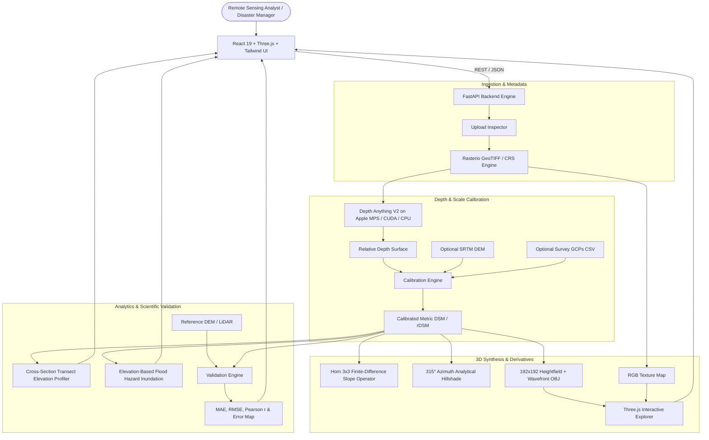

# DepthWizard: AI-Powered Single-View Remote-Sensing 3D Reconstruction

<div align="center">

**"From One Image to an Explorable 3D World"**

*An AI-powered single-view remote-sensing elevation reconstruction platform built for the ISRO Software Problem Statement under the Disaster Management theme.*

[](https://fastapi.tiangolo.com)
[](https://pytorch.org)
[](https://react.dev)
[](https://threejs.org)
[](https://rasterio.readthedocs.io)
[](LICENSE)

</div>

---

## 1. Executive Summary & Problem Context

In rapid-onset disaster response (floods, landslides, earthquakes, glacial outbursts), time is the most critical constraint. Traditional satellite photogrammetry requires overlapping multi-view stereo pairs, which are frequently unavailable in emergency single-pass satellite acquisitions.

**DepthWizard** bridges this critical gap. Given a **single 2D RGB optical image** (nadir satellite pass or aerial drone capture), DepthWizard:
1. Infers continuous scene depth geometry using a pretrained monocular vision transformer (**Depth Anything V2**).
2. Distinguishes strictly between **Relative Digital Surface Models (rDSM)** for unreferenced imagery and **Absolute Digital Surface Models (DSM)** for georeferenced GeoTIFFs.
3. Performs metric scale calibration using low-resolution reference DEMs (e.g. SRTM/CartoDEM) or Ground Control Points (GCPs) via robust Huber regression.
4. Generates an interactive **3D terrain mesh** with original RGB texture mapping, First-Person / Flythrough navigation, real-time height inspection, slope hazard zoning, and flood simulation.
5. Computes genuine quantitative evaluation metrics (**MAE, RMSE, Pearson $r$**) against reference elevation data without hardcoded or fabricated numbers.

---

## 2. System Architecture



---

## 3. Key Capabilities

| Capability | Georeferenced (GeoTIFF) | Non-Georeferenced (PNG/JPG) |
|---|---|---|
| **Spatial Metadata** | Full CRS, Affine Transform & Bounds Preserved | Marked as *"Spatial reference unavailable"* |
| **Surface Model** | Absolute Metric DSM ($Z$ in meters AMSL) | Relative rDSM ($Z$ in relative units $[0, 100]$) |
| **Calibration** | Robust Huber regression with DEM or GCPs | Standard normalized relief scaling |
| **Derivatives** | Horn 3x3 Slope ($^\circ$) & 315° Hillshade | Relative gradient & hillshade |
| **3D Navigation** | Orbit, WASD Flythrough, Top-Down Ortho | Orbit, WASD Flythrough, Top-Down Ortho |
| **Measurement** | Two-point vertical $\Delta Z$ in meters | Two-point vertical $\Delta Z$ in relative units |
| **Disaster Tools** | Flood simulation, slope hazard, transect profile | Elevation thresholding & transect profile |
| **Validation** | Co-registered MAE, RMSE, Pearson $r$, Error Map | Validated when reference is supplied |
| **Export Formats** | DSM GeoTIFF, Wavefront OBJ, Heightfield, PNGs, ZIP | rDSM GeoTIFF, Wavefront OBJ, PNGs, ZIP |

---

## 4. Technology Stack

- **Frontend**: React 18/19, TypeScript, Vite, Tailwind CSS, Three.js, React Three Fiber, Drei, Recharts, Lucide React, Framer Motion.
- **Backend**: Python 3.11, FastAPI, Uvicorn, Pydantic v2, Rasterio, PyProj, NumPy, SciPy, Scikit-learn, Pillow, OpenCV Headless.
- **Machine Learning**: PyTorch, Hugging Face Transformers (`depth-anything/Depth-Anything-V2-Small-hf`) with automatic hardware acceleration (**Apple Silicon MPS**, **NVIDIA CUDA**, or **CPU**) and standalone terrain synthesis fallback.
- **Testing**: Pytest test suite covering health, upload, pipeline execution, profile calculation, flood simulation, evaluation metrics, and export.

---

## 5. Quickstart & Local Setup

### Prerequisites
- Node.js (v18+)
- Python 3.11+
- Git

### 1. Clone & Setup Backend
```bash
git clone https://github.com/your-org/DepthWizard.git
cd DepthWizard

# Create and activate Python 3.11 virtual environment
python3.11 -m venv backend/venv
source backend/venv/bin/activate

# Install backend dependencies
pip install -r backend/requirements.txt

# Generate bundled demonstration datasets
python scripts/generate_sample_data.py
```

### 2. Setup Frontend
```bash
cd frontend
npm install
cd ..
```

---

## 6. Running the Application

### Start Backend API Server
```bash
# In terminal 1 (from repository root):
source backend/venv/bin/activate
PYTHONPATH=backend uvicorn app.main:app --host 127.0.0.1 --port 8000 --reload
```
API health endpoint will be accessible at: `http://127.0.0.1:8000/api/health`

### Start Frontend Dev Server
```bash
# In terminal 2 (from repository root):
cd frontend
npm run dev
```
Open your browser at: **`http://localhost:5173`**

---

## 7. Step-by-Step Live Demonstration Guide

### Option A: 1-Click Demo Datasets (Recommended for ISRO Judges)
1. Open the UI and click **"Launch Workspace"**.
2. Under **"Quick Start with Demo Datasets"**, select:
   - **Himalayan Ridge & Valley**: Georeferenced satellite scene with true reference DEM and 6 GCPs.
   - **Coastal Estuary**: Low-lying flood-prone coastal topography.
   - **Post-Disaster Aerial Survey**: High-resolution drone survey for relative rDSM demonstration.
3. Click **"Execute 3D Reconstruction"**.
4. Watch the real-time 11-stage processing timeline.
5. Click **"Launch 3D Explorer"**:
   - Use **Mouse Drag** to orbit, **Scroll** to zoom.
   - Switch to **Fly (WASD)** mode to fly freely across valleys and ridges.
   - Click **Measure ΔZ** and click any two points to measure real-time height differences.
   - Click **Flood Sim** and move the water elevation slider to highlight inundated zones.
   - Switch between **RGB Texture** and **Slope Texture**.
6. Navigate to **"Disaster Analytics"** to inspect the interactive **Cross-Section Elevation Profile**.
7. Navigate to **"Model Validation"** to review genuine **MAE, RMSE, Pearson $r$**, and the spatial **Error Map**.
8. Click **"Export Project"** in the top bar to download the complete ZIP package.

### Option B: Uploading Custom Data
- **Image**: Drag & drop any GeoTIFF, PNG, or JPG.
- **Reference DEM (Optional)**: Attach an SRTM/CartoDEM GeoTIFF.
- **GCPs (Optional)**: Attach a CSV with columns: `id,easting,northing,elevation`.

---

## 8. Running Automated Tests

Run the complete backend test suite:
```bash
source backend/venv/bin/activate
PYTHONPATH=backend pytest backend/tests/ -v
```

Test the frontend build:
```bash
cd frontend
npm run build
```

---

## 9. Scientific Honesty & Validation Policy

In adherence to ISRO remote-sensing standards:
1. **Never Invent Metrics**: MAE, RMSE, and Pearson correlation coefficients are computed solely when true reference elevation data is provided. When no reference data is uploaded, the interface honestly displays *"Validation unavailable — upload reference elevation data."*
2. **Honest Labeling**: Uncalibrated imagery is clearly designated as *Relative Elevation (rDSM)*.
3. **Illustrative Simulation**: Inundation tools are explicitly labeled: *"Illustrative elevation-based visualization — not a hydrological forecast."*
4. **Input Resolution & Continuous Reconstruction**: Small inputs (< 64×64 px) are explicitly flagged with a critical advisory noting preview-only capability and recommending ≥ 512×512 px. High-order bicubic resampling and spatial continuity filters ensure smooth, non-blocky 3D mesh surfaces while keeping data raster resolution and render mesh resolution strictly separated in the telemetry metadata.

---

## 10. License

This project is licensed under the MIT License - see the [LICENSE](LICENSE) file for details.
