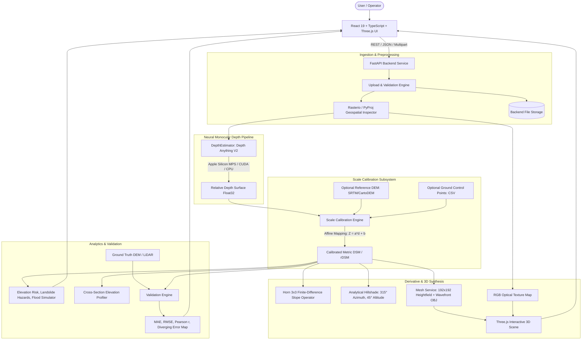

# DepthWizard: System Architecture & Technical Specification

DepthWizard is an AI-powered single-view remote-sensing 3D terrain reconstruction platform designed for the **ISRO Software Problem Statement** under the **Disaster Management** theme.

## 1. High-Level Architecture



## 2. Component Directory Structure

```
DepthWizard/
├── backend/
│   ├── app/
│   │   ├── api/             # REST endpoint routers
│   │   │   ├── upload.py    # Multi-format upload & raster inspection
│   │   │   ├── processing.py# 12-stage reconstruction pipeline
│   │   │   ├── visualization.py # 2D & 3D asset delivery
│   │   │   ├── evaluation.py# Ground truth reference validation
│   │   │   ├── samples.py   # Pre-bundled demo dataset catalog
│   │   │   └── export.py    # ZIP & multi-format export packaging
│   │   ├── config.py        # Settings, hardware detection, directory paths
│   │   ├── main.py          # FastAPI application & static mounts
│   │   ├── models/
│   │   │   └── depth_model.py # Depth Anything V2 + PyTorch MPS acceleration
│   │   ├── schemas/
│   │   │   └── schemas.py   # Strict Pydantic v2 schemas
│   │   └── services/
│   │       ├── depth_service.py      # Master pipeline orchestration
│   │       ├── geospatial_service.py # Rasterio GeoTIFF & PyProj CRS engine
│   │       ├── calibration_service.py# Huber regression & affine scaling
│   │       ├── dsm_service.py        # Horn slope, hillshade & colormaps
│   │       ├── mesh_service.py       # Heightfield & OBJ generator
│   │       └── evaluation_service.py # MAE, RMSE, Pearson r, Error map
│   ├── storage/             # Clean structured file storage
│   ├── tests/               # Pytest automated test suite
│   └── requirements.txt     # Python dependencies
├── frontend/
│   ├── src/
│   │   ├── components/      # Compass, HUD, MeasurementTool, FloodPlane, Mesh
│   │   ├── context/         # ProjectContext state provider
│   │   ├── layouts/         # AppLayout sidebar and telemetry bar
│   │   ├── pages/           # 8 core application pages
│   │   ├── services/        # API client
│   │   └── types/           # TypeScript domain definitions
│   └── package.json
└── data/
    └── samples/             # Bundled Himalayan, Coastal & Aerial datasets
```

## 3. Hardware Acceleration

The `DepthEstimator` subsystem dynamically probes available hardware at startup:
- **Apple Silicon**: Uses `mps` (Metal Performance Shaders) for sub-second inference on Mac laptops.
- **NVIDIA GPU**: Uses `cuda:0` when CUDA drivers and GPUs are present.
- **CPU**: Clean fallback with PyTorch multi-threaded CPU execution.
